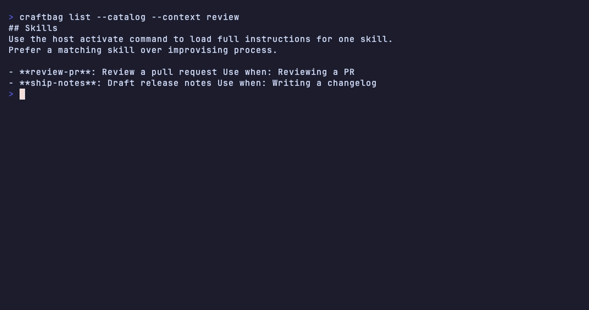

# craftbag

Discover, list, load, and explain Agent Skills (`SKILL.md`) for CLI and MCP hosts.

[](https://github.com/craftbag/craftbag/actions/workflows/ci.yml)
[](https://github.com/craftbag/craftbag/actions/workflows/security.yml)
[](https://crates.io/crates/craftbag)
[](https://docs.rs/craftbag)
[](LICENSE)

[](https://www.bestpractices.dev/projects/14274)
[](https://securityscorecards.dev/viewer/?uri=github.com/craftbag/craftbag)
[](https://app.fossa.com/projects/custom%2B62586%2Fgithub.com%2Fcraftbag%2Fcraftbag?ref=badge_shield&issueType=license)
[](https://github.com/craftbag/craftbag/releases/latest)

## What it does

craftbag walks project and home skill trees (`.agents`, plus optional vendor trees for Claude, Cursor, Grok, and Bline). It then:

- catalogs skills (`list`)
- prints one skill body (`load`), or heading keys / one heading (`load --outline`, `load --section KEY`)
- explains why a skill would activate (`why`)
- checks a package (`validate`)

The same operations exist over MCP stdio (`skills_list`, `skills_load`, `skills_why`, `skills_validate`). Hosts can filter, rank, and load skills without taking a dependency on any one agent product.

## Install

macOS and Linux (Homebrew):

```bash
brew install craftbag/tap/craftbag
```

Windows (Scoop):

```powershell
scoop bucket add craftbag https://github.com/craftbag/scoop-bucket
scoop install craftbag/craftbag
```

Both commands install `craftbag` and `craftbag-mcp`. The MCP host then runs `craftbag-mcp` (on macOS GUI apps, use the full path if `PATH` is empty: `/opt/homebrew/bin/craftbag-mcp`).

From a Rust toolchain (crates.io):

```bash
cargo install --locked craftbag-cli
cargo install --locked craftbag-mcp
```

Library dependency:

```toml
craftbag = "0.1"
```

From git (unreleased tip):

```bash
cargo install --locked --git https://github.com/craftbag/craftbag craftbag-cli
cargo install --locked --git https://github.com/craftbag/craftbag craftbag-mcp
```

MSRV is 1.85.

## Getting started

Default `list` walks cwd-to-git `.agents` / vendor trees and `$HOME/.agents` / vendor trees. This clone has no project `.agents`, so `craftbag list` here prints nothing and exits 0. Point `--path` at the demo tree (same catalog as the demo GIF):

```bash
git clone https://github.com/craftbag/craftbag
cd craftbag
craftbag list --no-implicit-roots --path demo/workspace/.agents/skills --catalog
craftbag load review-pr --no-implicit-roots --path demo/workspace/.agents/skills
craftbag load review-pr --no-implicit-roots --path demo/workspace/.agents/skills --outline
craftbag load review-pr --no-implicit-roots --path demo/workspace/.agents/skills --section review-a-pull-request
craftbag why review-pr --no-implicit-roots --path demo/workspace/.agents/skills --context review
craftbag validate demo/workspace/.agents/skills/review-pr
```

If `craftbag` is not on `PATH` yet, `cargo build -p craftbag-cli --locked` and use `./target/debug/craftbag` in those commands.

In a project that already has skills under `.agents/skills`:

```bash
craftbag list --catalog
craftbag load NAME
craftbag why NAME --context review
craftbag validate ./path/to/my-skill
```

Claude, Cursor, Grok, or Bline trees are opt-in:

```bash
craftbag list --vendor claude --catalog
```

## Demo



## MCP

`craftbag-mcp` speaks JSON-RPC on stdio. Tools: `skills_list`, `skills_load`, `skills_why`, `skills_validate`. After `brew install` or `scoop install`, `craftbag-mcp --help` names them.

Claude Desktop (`claude_desktop_config.json`) and other hosts that take a stdio command:

```json
{
  "mcpServers": {
    "craftbag": {
      "command": "craftbag-mcp",
      "args": ["--vendor", "claude"]
    }
  }
}
```

Launch `--path`, `--vendor`, `--user-dir`, and `--no-implicit-roots` are the walk when a tool call omits that field. The host cwd is still the implicit walk root unless you pass `--no-implicit-roots`. `skills_load` accepts `outline` and `section` (same as `load --outline` / `--section KEY`).

## Library

```rust
use craftbag::{discover, DiscoveryOptions};

let cwd = std::env::current_dir()?;
let report = discover(&cwd, &DiscoveryOptions::default())?;
for skill in &report.skills {
    println!("{} {}", skill.name, skill.description);
}
```

`implicit_roots` is on by default (cwd-to-git `.agents` and `$HOME/.agents`). Set it to `false` and put collection roots in `paths` for leftover-only hosts. `format_load_view` can print an outline or one heading instead of the whole body.

## Contributing

See [CONTRIBUTING.md](CONTRIBUTING.md). Security reports go to [SECURITY.md](SECURITY.md). Roadmap and governance are in [ROADMAP.md](ROADMAP.md) and [GOVERNANCE.md](GOVERNANCE.md).

## License

Apache-2.0 or MIT. You may choose either. See `LICENSE` and `LICENSE-APACHE`.
